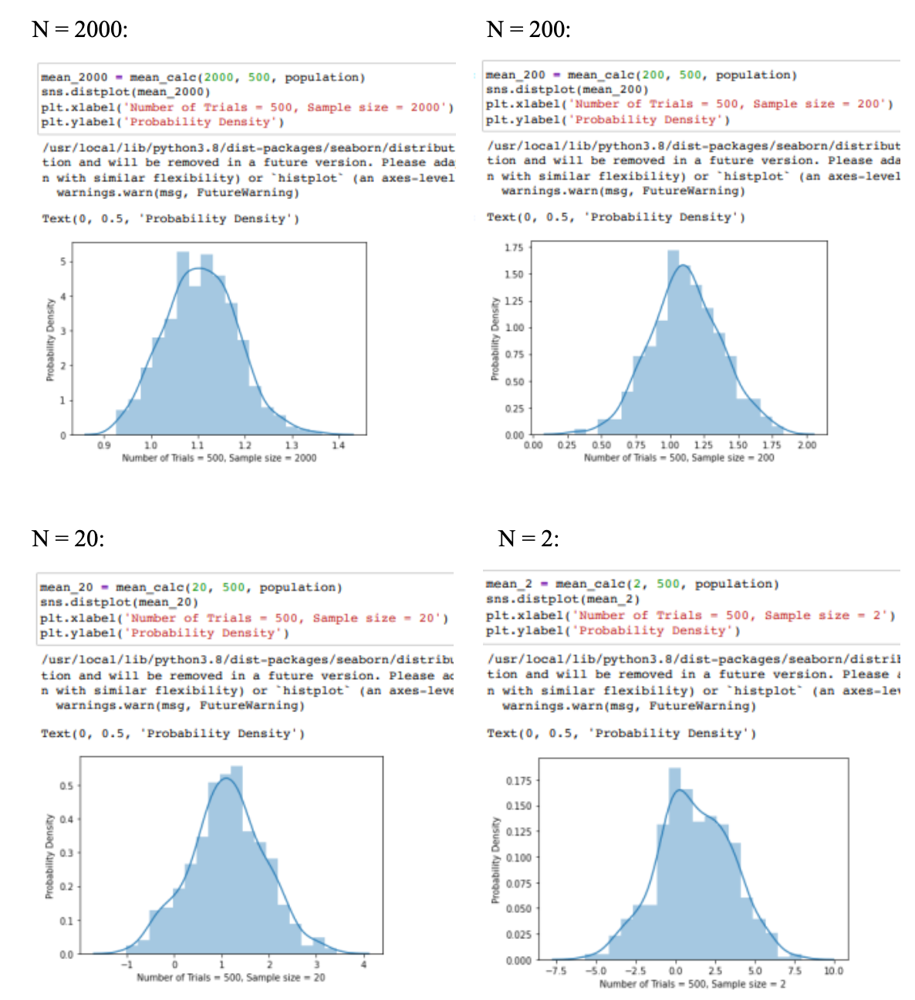

# Central Limit Theorem
In this project, we investigated the Central Limit Theorem (CLT) through practical implementation and analysis. Our approach involved generating a large population and examining the properties of sample means to understand how they converge to a normal distribution.

## Methodology

1. **Population Generation**:
   - We randomly generate a population of 100,000 data points.

2. **Sampling and Analysis**:
   - We randomly drew `n` samples from this population and computed the mean for each sample.
   - This process was repeated `s` times to gather a distribution of sample means.
   - We plotted these sample means to visualize their distribution and compared it to a normal distribution to verify the CLT:
  
     Results are as below:

     

3. **Wine Dataset Analysis**:
   - Next we load another dataset, and we plot its distribution function to understand its characteristics.
   - We also drew random samples of varying sizes `n` from this dataset and repeated the sampling `s` times.

     Some samples are as below:

     

      
We compared the resulting distribution of sample means with the normal distribution and evaluated the mean and standard deviation against the theoretical predictions of the CLT. Results are as below:

Comparing the results with the new normal distributions for data from the first dataset:

Comparing the results with the new normal distributions for data from the second dataset:

     

## Results

The results confirmed the Central Limit Theorem, showing that as sample sizes increased, the distribution of sample means approached a normal distribution  with a mean equal to the mean of the sample set, and a standard deviation equal to the std/(n^0.5).

